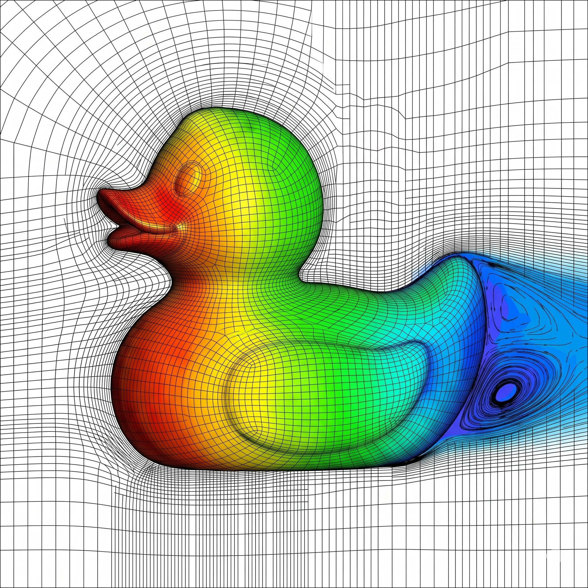

# 🦑 [SinsuSquid](https://github.com/SinsuSquid) 🦑
SinsuSquid (신수동오징어) a.k.a. Beomgyu Kang (강범규)

<!-- START_DDAY -->

### 🧙‍♂️ You're a wizard
🔮 **94.3%** [▓▓▓▓▓▓▓▓▓▓▓▓▓▓▓▓▓▓▓░]

🪄 **Started:** 1998-03-10 | ⏳ **Days Remaining:** 621 days left | 🏁 **Target:** 2028-03-10

<!-- END_DDAY -->

## Experiences

- Intern, HPC Application Team (HPC 응용팀), Supercomputing Application Support Center (슈퍼컴퓨팅응용지원센터) @ Korea Institute of Science and Technology Information (KISTI, 한국과학기술정보연구원) (2026.03~)

- Researcher, Specialty Chemical Research Team @ ISU SPECIALTY CHEMICAL (2025.07~2025.11)

- Master's Degree in Chemistry @ Sogang Univ. (2023.09~2025.06)

- Bachelor's Degree in Chemistry and Big Data Science @ Sogang Univ. (2017-2023)

## Publications
- "Chemomile: Explainable Multi-Level GNN Model for Combustion Property Prediction", **Beomgyu Kang** and B. J. S.*, *J. Phys. Chem. A* 2025, 129, 1880-1889, https://doi.org/10.1021/acs.jpca.5c00380
- "Non-Monotonic Ion Conductivity in Lithium-Aluminium-Chloride Glass Solid-State Electrolytes Explained by Cascading Hoping", **Beomgyu Kang**, J. Yu, S. Saito, J. Jang and B. J. S.*, *Advanced Science* 2025, 12, 45, e09205, https://doi.org/10.1002/advs.202509205

## Contacts
- e-mail : beomgyu.kang.kor@gmail.com
- LinkedIn : https://www.linkedin.com/in/beomgyu-kang-694425408/
